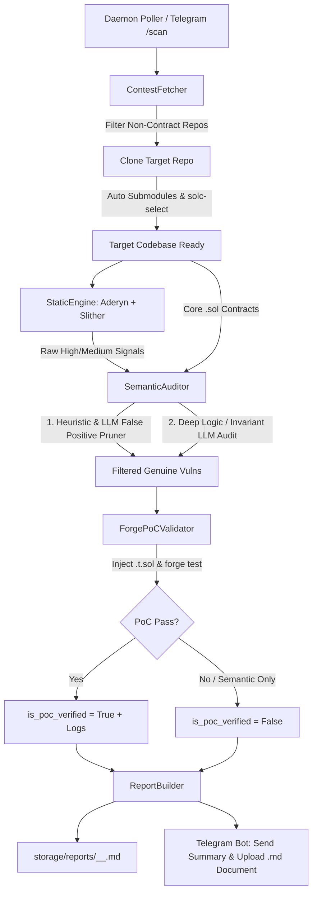

# 🧠 AI Agent Instructions & Project Context: BlackStar (Autonomous Web3 Audit Engine)

> **Note for AI Chatbots (ChatGPT, Claude, Gemini, DeepSeek, Cursor, Copilot):**
> This file is your primary orientation briefing for the **BlackStar / Tesseract Autonomous Web3 Smart Contract Audit Engine**.
> Read this document to understand the codebase architecture, mission, data flow, key abstractions, and how to assist the user in brainstorming, auditing, debugging, or adding new capabilities.

---

## 🎯 Project Mission & Overview

**BlackStar** is an end-to-end, 24/7 autonomous security engine designed to compete in Web3 smart contract bug bounties and competitive audit contests (**Code4rena**, **Sherlock**, **Cantina**, and **Immunefi**).

Instead of relying solely on raw static analysis tools (which suffer from >90% false positive rates), BlackStar orchestrates a **multi-stage verification pipeline**:
1. **Autonomous Target Fetching:** Scrapes active contests from GitHub orgs (`code-423n4`, `sherlock-audit`), clones repos, resolves submodules, and auto-configures `solc-select` compiler versions.
2. **Dual Static Security Scanning:** Executes **Cyfrin Aderyn** (Rust AST static analyzer) and **Trail of Bits Slither** in parallel.
3. **LLM Semantic Verification & Invariant Auditing:** Uses Google Gemini (2.5 Pro / Flash) or OpenAI models combined with deterministic heuristic AST triage to eliminate false positives (e.g., access-controlled transfers, CEI-compliant reentrancy, safe downcasts) and identify complex business logic bugs (flash loan attacks, price manipulation, oracle slippage, precision loss).
4. **Automated Foundry PoC Validation:** Generates executable `.t.sol` test files and executes `forge test -vvv` to empirically prove exploitability before reporting.
5. **Submission-Ready Reporting & Remote Telegram Control:** Produces structured Markdown reports matching Code4rena/Sherlock submission standards and delivers instant `.md` file alerts & remote commands (`/status`, `/scan`, `/reports`, `/getreport`, `/pause`, `/resume`) via Telegram.

---

## 📁 Repository Directory Structure

```text
.
├── AGENTS.md                   # AI Agent guidance & architectural context (You are here)
├── ARCHITECTURE.md             # Deep technical architecture & flowcharts
├── README.md                   # Public repository documentation
├── .gitignore                  # Security & artifact exclusions
└── audit-engine/               # Core Python Engine
    ├── config.py               # Engine configuration & environment bindings
    ├── main.py                 # CLI Orchestrator & Daemon Runner
    ├── run.sh                  # Execution wrapper (exports PATH & venv)
    ├── setup_telegram.py       # Interactive Telegram Bot setup wizard
    ├── analyzers/
    │   └── static_engine.py    # Static analysis integrations (Aderyn & Slither)
    ├── fetcher/
    │   └── contest_fetcher.py  # GitHub contest scraper, git cloner & solc detector
    ├── llm_core/
    │   └── semantic_auditor.py # Gemini/OpenAI LLM verifier & invariant auditor
    ├── poc_generator/
    │   └── forge_validator.py  # Foundry .t.sol PoC executor & template generator
    ├── reporter/
    │   └── report_builder.py   # Markdown report builder & Telegram/Discord dispatcher
    ├── telegram_bot/
    │   └── telegram_controller.py # 2-way interactive Telegram Bot controller
    └── storage/
        ├── repos/              # Cloned target contest repositories (gitignored)
        ├── reports/            # Generated vulnerability reports (.md)
        └── cache/              # Deduplication cache (scanned_contests.json)
```

---

## 🔄 Core Pipeline Lifecycle & Data Flow



---

## 🧩 Key Data Models & Classes

### 1. `ContestTarget` (`fetcher/contest_fetcher.py`)
Represents an audit contest target.
- `platform`: `"Code4rena" | "Sherlock" | "Local" | "OnDemand"`
- `name`: Repository name (e.g. `"2026-04-monetrix"`)
- `repo_url`: GitHub clone URL
- `local_path`: Resolved local path (`Path`)
- `framework`: `"foundry" | "hardhat" | "truffle" | "unknown"`

### 2. `StaticFinding` (`analyzers/static_engine.py`)
Raw signal from static analyzers.
- `source_tool`: `"aderyn" | "slither"`
- `detector`: Rule identifier (e.g. `"arbitrary-send-erc20"`, `"reentrancy-state-change"`)
- `title`: Short title
- `severity`: `"High" | "Medium" | "Low"`
- `locations`: List of `VulnerabilityLocation(file_path, start_line, end_line, contract_name)`

### 3. `VerifiedVulnerability` (`llm_core/semantic_auditor.py`)
Submission-grade vulnerability object.
- `title`: Standardized vulnerability title
- `severity`: `"High" | "Medium"`
- `contract_name`: Target contract name
- `file_path` & `line_range`: Exact code coordinates
- `impact_summary`: Concise summary of financial or protocol impact
- `detailed_path`: Technical root cause analysis
- `exploit_scenario`: Numbered step-by-step reproduction path
- `recommended_mitigation`: Code-level fix instructions
- `poc_solidity_code`: Optional Foundry `.t.sol` test code
- `is_poc_verified`: Boolean flag (`True` if Foundry test passed)

---

## 💡 How AI Chatbots Should Brainstorm & Assist

When the user discusses new features or asks for help:
1. **Understand Context First:** Check which layer is being discussed (Fetcher, Static Analyzers, LLM Semantic Auditor, PoC Generator, Reporting, or Telegram Controller).
2. **Prioritize True Exploits over Noise:** When reviewing findings or designing rules, focus on high-impact DeFi invariant violations (e.g., flash loan drain, exchange rate inflation in ERC4626, read-only reentrancy during price query, rounding direction errors in debt/reward shares).
3. **Follow Code Standards:**
   - Python 3.10+ with type annotations and `Pydantic` v2 models.
   - Preserve robust error handling (timeouts, subprocess error capture, network reconnects).
   - Keep `.env` secrets safe (never commit tokens or API keys).
4. **Foundry PoC Style:** When drafting PoC code, use `forge-std/Test.sol`, `vm.prank()`, `vm.deal()`, and clean assertions (`assertEq`, `assertGt`, `assertTrue`).

---

## ⚡ Quick CLI Commands

```bash
# Run 24/7 background daemon (with Telegram listener)
./run.sh --daemon

# Run standalone Telegram interactive controller
./run.sh --bot

# Audit a specific local repository
./run.sh --scan-local storage/repos/code4rena/2026-04-monetrix

# List generated audit reports
./run.sh --list-reports

# Health check all underlying tools (Forge, Aderyn, Slither, Solc)
./run.sh --check-tools
```
