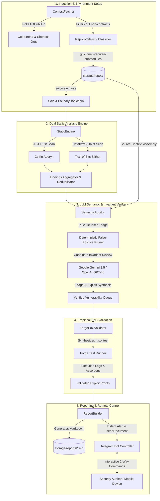
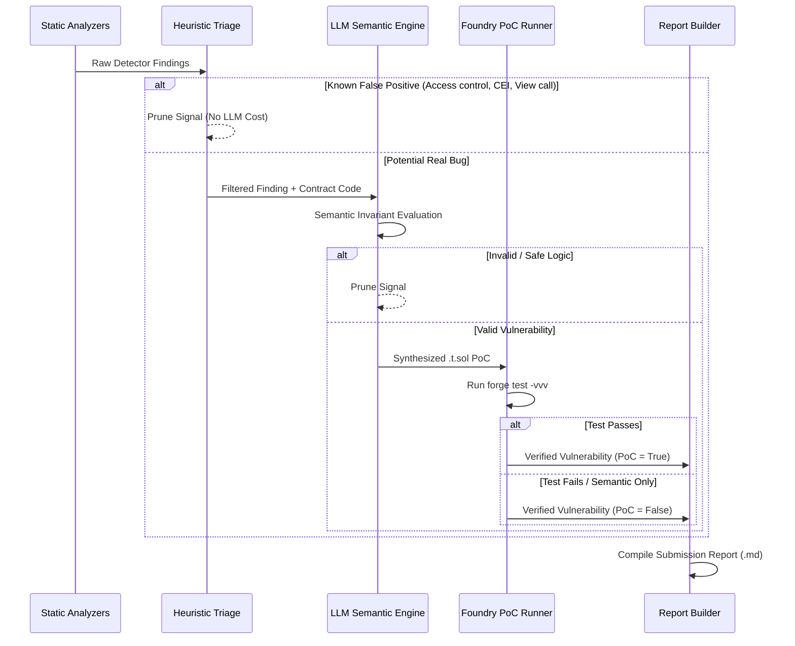

# 🏛️ BlackStar: Architecture & Technical Design

## 1. System Architecture Overview

BlackStar is constructed as a modular, decoupled pipeline where each stage adds semantic depth and reduces false positives:

---

## 2. Component Specifications

### 2.1 Fetcher (`fetcher/contest_fetcher.py`)
- **Polling Loop:** Regularly queries GitHub REST APIs for newly published contest repositories from configured audit organizations (`code-423n4`, `sherlock-audit`).
- **Classifier & Filter:** Automatically filters out contest judging repos (`*-judging`), findings repositories, profile repositories, and pure documentation.
- **Dependency Resolver:** Runs `git submodule update --init --recursive`, `forge install`, and `npm install` (offline preferred) if required.
- **Solc Versioning:** Inspects Solidity source files for `pragma solidity` declarations and executes `solc-select use <version>` dynamically.

### 2.2 Static Engine (`analyzers/static_engine.py`)
- **Aderyn Integration:** Invokes binary `aderyn --output <json>` to extract high, medium, and low issues with line numbers and contract mappings.
- **Slither Integration:** Executes `slither . --json <json> --filter-paths "node_modules|lib|test|tests|mocks"` to extract dataflow anomalies, reentrancy vulnerabilities, arbitrary sends, and unchecked returns.
- **Deduplication:** Normalizes detector names and locations into `StaticFinding` objects.

### 2.3 Semantic Auditor (`llm_core/semantic_auditor.py`)
- **Heuristic AST Pruner:** Instantly eliminates common static false positives without consuming LLM tokens:
  - `arbitrary-send-erc20`: Checks if the caller is restricted by `onlySender`, `onlyOwner`, or strict equality modifiers.
  - `reentrancy-state-change`: Verifies if the call is a view function (e.g., `balanceOf`) and state mutations follow the Checks-Effects-Interactions (CEI) pattern.
  - `contract-locks-ether`: Discards findings on contracts without payable functions.
- **LLM Semantic Engine:** Queries Google Gemini (`gemini-2.5-flash` / `gemini-2.5-pro`) or OpenAI to:
  - Validate economic invariants and protocol logic.
  - Generate precise step-by-step exploit scenarios.
  - Construct clean remediation guidance.
  - Synthesize `.t.sol` Foundry test scripts.

### 2.4 PoC Validator (`poc_generator/forge_validator.py`)
- Injects generated Foundry test contracts into the target repository's `test/` directory.
- Runs `forge test --match-path <poc_file> -vvv` in an isolated process.
- Captures assertion results, gas consumption, and stack traces. If the test passes, the vulnerability is flagged as `✅ Foundry PoC Verified`.

### 2.5 Telegram Bot Controller (`telegram_bot/telegram_controller.py`)
- Operates a non-blocking asynchronous long-polling loop with Telegram Bot API.
- Implements strict authorization matching `TELEGRAM_CHAT_ID`.
- Handles interactive commands: `/status`, `/tools`, `/scan <target>`, `/reports`, `/getreport <file>`, `/findings`, `/pause`, `/resume`, and `/help`.
- Dispatches formatted Markdown summaries and uploads physical `.md` files via `sendDocument`.

---

## 3. Vulnerability Quality Triage Flow

