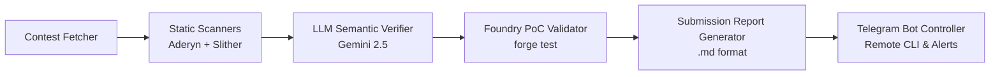

# 🛡️ BlackStar: Autonomous Web3 Smart Contract Audit Engine (24/7)

[](https://www.python.org/)
[](https://getfoundry.sh/)
[](https://cyfrin.io/)
[](https://github.com/crytic/slither)
[](https://ai.google.dev/)
[](https://core.telegram.org/bots)

An end-to-end, 24/7 autonomous security engine that monitors, clones, analyzes, and produces submission-ready smart contract audit reports for **Code4rena**, **Sherlock**, **Cantina**, and **Immunefi**.

---

## 🌟 Key Highlights

- 🚀 **Autonomous 24/7 Target Fetcher:** Continuously checks GitHub for newly published contests from Code4rena & Sherlock, auto-clones repos, initializes git submodules, and dynamically configures compiler versions via `solc-select`.
- ⚡ **Dual Static Security Scanning:** Combines **Cyfrin Aderyn** (Rust AST analyzer) and **Trail of Bits Slither** to capture maximum code coverage.
- 🧠 **LLM Semantic Invariant Auditor:** Powered by **Google Gemini 2.5 (Flash / Pro)** and deterministic heuristic AST verification to prune false positives and identify deep economic/logic vulnerabilities (flash loans, oracle manipulation, reentrancy, precision loss).
- 🧪 **Foundry PoC Auto-Validator:** Synthesizes executable `.t.sol` Foundry test cases and runs `forge test -vvv` to empirically prove exploits before submission.
- 📱 **Interactive Telegram Remote Controller:** Control and monitor the engine directly from your mobile device via commands (`/status`, `/scan`, `/reports`, `/getreport`, `/pause`, `/resume`), with automatic `.md` report document delivery.

---

## 🏗️ Architecture



Detailed technical design & sequence diagrams are available in [**`ARCHITECTURE.md`**](ARCHITECTURE.md) and [**`AGENTS.md`**](AGENTS.md).

---

## 📂 Project Structure

```text
.
├── AGENTS.md                   # AI Agent guidance & architectural context
├── ARCHITECTURE.md             # Deep technical architecture & flowcharts
├── README.md                   # Project overview & documentation
├── .gitignore                  # Security & artifact exclusions
└── audit-engine/               # Core Python Engine
    ├── config.py               # Engine configuration & environment bindings
    ├── main.py                 # CLI Orchestrator & Daemon Runner
    ├── run.sh                  # Execution wrapper (exports PATH & venv)
    ├── setup_telegram.py       # Interactive Telegram Bot setup wizard
    ├── analyzers/              # Static analysis integrations (Aderyn & Slither)
    ├── fetcher/                # GitHub contest scraper, cloner & solc detector
    ├── llm_core/               # Gemini/OpenAI LLM verifier & invariant auditor
    ├── poc_generator/          # Foundry .t.sol PoC executor & template generator
    ├── reporter/               # Markdown report builder & Telegram dispatcher
    ├── telegram_bot/           # 2-way interactive Telegram Bot controller
    └── storage/
        ├── repos/              # Cloned target contest repositories (gitignored)
        ├── reports/            # Generated vulnerability reports (.md)
        └── cache/              # Deduplication cache (scanned_contests.json)
```

---

## ⚡ Quickstart & Usage

### 1. Prerequisites
Ensure you have the following installed:
- Python 3.10+
- [Foundry (`forge`)](https://getfoundry.sh/)
- [Cyfrin Aderyn](https://github.com/Cyfrin/aderyn)
- [Slither](https://github.com/crytic/slither) & `solc-select`

### 2. Environment Setup
```bash
cd audit-engine
cp .env.example .env
# Edit .env with your Telegram Bot token and Gemini / OpenAI API keys
```

### 3. Running the Engine

```bash
# Health check all underlying security tools
./run.sh --check-tools

# Run 24/7 background autonomous daemon (includes Telegram controller)
./run.sh --daemon

# Run standalone Telegram interactive controller
./run.sh --bot

# Audit a specific local repository or contest folder
./run.sh --scan-local storage/repos/code4rena/2026-04-monetrix

# List all generated audit reports
./run.sh --list-reports
```

---

## 🤖 Telegram Bot Commands

When the bot is active, message your Telegram bot with:

| Command | Description |
|---|---|
| `/status` | View daemon state, uptime, scanned targets count, and reports summary |
| `/tools` | Health-check status of Forge, Aderyn, Slither, Solc, and LLM |
| `/scan <target>` | Trigger an on-demand audit for a local folder or GitHub URL |
| `/reports` | List recent generated audit reports |
| `/getreport <index/name>` | Download physical `.md` report file directly to your phone/PC |
| `/findings` | View active High and Medium verified vulnerabilities |
| `/pause` | Pause the 24/7 daemon poller loop |
| `/resume` | Resume the 24/7 daemon poller loop |
| `/help` | Show interactive command list and usage guide |

---

## 🛡️ Submission Standards Supported

Generated reports follow the official submission specifications of:
- **Code4rena** (High/Medium Severity, Root Cause, Exploit Scenario, PoC, Mitigation)
- **Sherlock** (Impact, Proof of Concept, Code Snippet, Vulnerability Detail)
- **Cantina & Immunefi** (CVSS-style Impact, Asset in Scope, Step-by-Step Proof)

---

## 📄 License

MIT License. Designed for ethical Web3 security auditing and bug bounty research.
